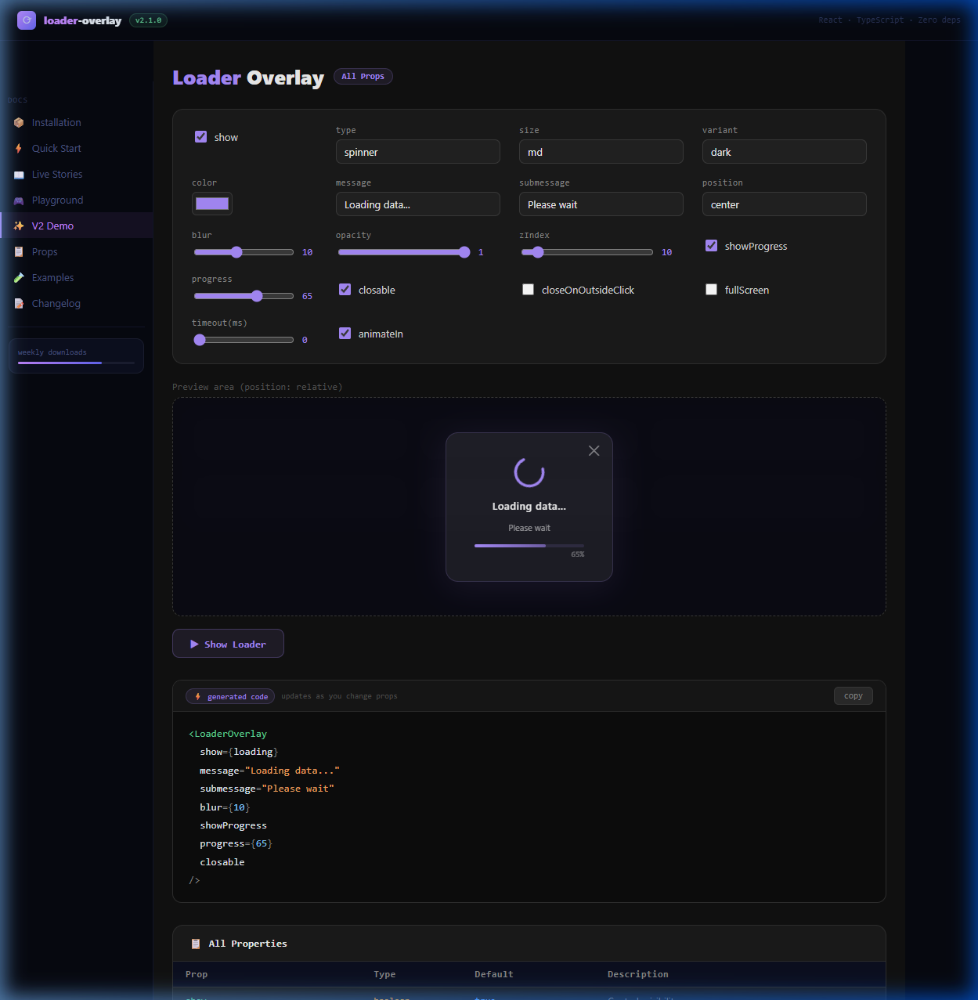

# loader-overlay

> A fully-featured React loader overlay component — 5 animation types, full theme control, progress tracking, outside-click dismissal, and **zero dependencies**.

<!--
[](https://www.npmjs.com/package/loader-overlay)
[](https://www.npmjs.com/package/loader-overlay)
[](LICENSE)
-->
[](https://www.typescriptlang.org/)
[](https://bundlephobia.com/package/loader-overlay)

---

## 🌐 Live Demo

👉 **[Try the interactive playground →](https://loader-overlay-plugin.vercel.app/)**



---

## ✨ Features

- 🎡 **5 loader types** — `spinner`, `dots`, `pulse`, `ring`, `bar`
- 🎨 **5 variants** — `dark`, `light`, `blur`, `transparent`, `gradient`
- 📊 **Progress bar** — animated shimmer progress tracking
- 🖱️ **Outside click dismiss** — close on backdrop click
- ⏱️ **Auto-dismiss** — timeout-based auto-hide
- ♿ **Accessible** — keyboard and screen reader friendly
- 📦 **Zero dependencies** — only peer dep is React 17+
- 🌳 **Tree-shakeable** — ESM and CJS builds
- 💙 **TypeScript ready** — full type definitions included

---

## 📦 Installation

```bash
# npm
npm install loader-overlay

# yarn
yarn add loader-overlay

# pnpm
pnpm add loader-overlay

# bun
bun add loader-overlay
```

### Peer Dependencies

Make sure these are already in your project:

```json
{
  "react": ">=17.0.0",
  "react-dom": ">=17.0.0"
}
```

---

## 💻 Local Installation

We provide a dedicated `consumer-demo` application directly in the repository to guarantee a seamless local installation testing environment out-of-the-box.

### Using the Built-in Consumer Demo

```bash
git clone https://github.com/swapnilhpatil/loader-overlay-plugin.git
cd loader-overlay-plugin
npm install && npm run build

# Navigate to the standalone consumer-demo test application
cd consumer-demo
npm install          # Automatically links to file:../
npm run dev          # Tests the compiled library package locally!
```

### Install from Local Path (In your own App)

```bash
# Point directly to your local clone of loader-overlay
npm install file:../loader-overlay  # npm 
yarn add ../loader-overlay          # yarn
pnpm add ../loader-overlay          # pnpm
```

### Install from Tarball

```bash
# In loader-overlay dir
npm pack                            # creates loader-overlay-x.x.x.tgz

# In your app
npm install ../loader-overlay/loader-overlay-1.0.0.tgz
```

### Install from GitHub

```bash
npm install swapnilhpatil/loader-overlay-plugin        # latest
npm install swapnilhpatil/loader-overlay-plugin#v1.0.0 # specific tag
```

> See [SETUP_GUIDE.md](SETUP_GUIDE.md) for the full local installation guide including workspaces, path aliases, and pnpm/yarn link methods.

---

## 🚀 Quick Start

```jsx
import { useState } from 'react';
import LoaderOverlay from 'loader-overlay';

export default function App() {
  const [loading, setLoading] = useState(false);

  const fetchData = async () => {
    setLoading(true);
    await fetch('/api/data');
    setLoading(false);
  };

  return (
    <div style={{ position: 'relative' }}>
      <LoaderOverlay show={loading} />
      <button onClick={fetchData}>Load Data</button>
    </div>
  );
}
```

---

## 📥 Imports

```js
// Default import
import LoaderOverlay from 'loader-overlay';
```

```js
// Named imports — tree-shakeable (icons & constants)
import { SpinIcon, DotsIcon, PulseIcon, RingIcon, BarIcon } from 'loader-overlay';
import { SIZES, VARIANTS, ANIM_CSS, ICONS } from 'loader-overlay';
```

```ts
// TypeScript — no @types package needed, types are bundled
import type { LoaderOverlayProps, LoaderType, LoaderVariant, LoaderSize } from 'loader-overlay';
```

---

## 📖 Usage Examples

### With Progress Bar

```jsx
<LoaderOverlay
  show={uploading}
  type="bar"
  variant="gradient"
  color="#60d394"
  message="Uploading file..."
  showProgress
  progress={uploadPercent}
/>
```

### Outside Click Dismiss

```jsx
<LoaderOverlay
  show={loading}
  fullScreen
  closeOnOutsideClick
  closable
  onClose={() => setLoading(false)}
  message="Processing..."
/>
```

### Auto-dismiss with Timeout

```jsx
<LoaderOverlay
  show={loading}
  timeout={3000}
  onClose={() => setLoading(false)}
  message="Done in 3 seconds..."
  type="dots"
/>
```

### Custom Children

```jsx
<LoaderOverlay show={loading} variant="dark">
  <div style={{ textAlign: 'center' }}>
    
    <p style={{ color: 'white' }}>Brewing your dashboard ☕</p>
  </div>
</LoaderOverlay>
```

### TypeScript

```tsx
import LoaderOverlay, { LoaderOverlayProps } from 'loader-overlay';

const props: LoaderOverlayProps = {
  show: true,
  type: 'spinner',
  variant: 'dark',
  color: '#a78bfa',
};
```

---

## 🎛️ Props Reference

| Prop | Type | Default | Description |
|------|------|---------|-------------|
| `show` | `boolean` | `true` | Controls loader overlay visibility |
| `type` | `'spinner' \| 'dots' \| 'pulse' \| 'ring' \| 'bar'` | `'spinner'` | Selection of loader animation type |
| `size` | `'sm' \| 'md' \| 'lg' \| 'xl'` | `'md'` | Configures the size footprint of the loader |
| `variant` | `'dark' \| 'light' \| 'blur' \| 'transparent' \| 'gradient'` | `'dark'` | Defines the overlay background aesthetic |
| `color` | `string` | `'#a78bfa'` | Master accent color (hex, rgb, or css var) |
| `message` | `string` | `'Loading...'` | Primary status label |
| `submessage` | `string` | `''` | Secondary hint or details text |
| `fullScreen` | `boolean` | `false` | Fixes overlay relative to viewport vs parent |
| `zIndex` | `number` | `999` | Determines the CSS z-index |
| `opacity` | `number` | `1` | Configures the global backdrop opacity |
| `blur` | `number` | `8` | Frosts the backdrop via CSS blur (px) |
| `position` | `'center' \| 'top' \| 'bottom'` | `'center'` | Vertical alignment of the main content box |
| `showProgress` | `boolean` | `false` | Activates an animated precise progress bar |
| `progress` | `number` | `0` | Progress value injected into the bar (0–100) |
| `closable` | `boolean` | `false` | Displays a dismiss ✕ button in the corner |
| `onClose` | `() => void` | `() => {}` | Event fired exactly when the overlay unmounts |
| `closeOnOutsideClick` | `boolean` | `false` | Allows backdrop clicks to dismiss the loader |
| `onOutsideClick` | `() => void` | `() => {}` | Granular event fired on backdrop interaction |
| `animateIn` | `boolean` | `true` | Allows smooth CSS fade-in animations on mount |
| `timeout` | `number` | `0` | Automatic unmount dismissal after specified ms |
| `children` | `ReactNode` | `null` | Drops in totally generic DOM replacing core icons |

---

## 🔧 Reusable Hook

```tsx
import { useState, useCallback } from 'react';
import LoaderOverlay from 'loader-overlay';

function useLoader() {
  const [state, setState] = useState({
    show: false,
    message: 'Loading...',
    progress: 0,
  });

  const start = useCallback((message = 'Loading...') => {
    setState({ show: true, message, progress: 0 });
  }, []);

  const setProgress = useCallback((progress: number) => {
    setState(s => ({ ...s, progress }));
  }, []);

  const stop = useCallback(() => {
    setState(s => ({ ...s, show: false }));
  }, []);

  return { loaderProps: state, start, setProgress, stop };
}

// Usage
function MyPage() {
  const { loaderProps, start, stop } = useLoader();

  return (
    <>
      <LoaderOverlay {...loaderProps} showProgress fullScreen />
      <button onClick={() => { start('Saving...'); setTimeout(stop, 2000); }}>
        Save
      </button>
    </>
  );
}
```

---

## 🌐 Route Transitions (React Router v6)

```tsx
import { useNavigation, Outlet } from 'react-router-dom';
import LoaderOverlay from 'loader-overlay';

export default function RootLayout() {
  const navigation = useNavigation();

  return (
    <>
      <LoaderOverlay
        show={navigation.state !== 'idle'}
        fullScreen
        type="dots"
        variant="dark"
        message="Navigating..."
        zIndex={9999}
      />
      <Outlet />
    </>
  );
}
```

---

## 📁 Package Structure

```text
loader-overlay/
├── dist/
│   ├── loader-overlay.d.ts          ← TypeScript declarations
│   ├── loader-overlay.es.js         ← ES module (tree-shakeable)
│   ├── loader-overlay.es.js.map     ← Source map
│   ├── loader-overlay.umd.js        ← UMD for CommonJS / CDN use
│   └── loader-overlay.umd.js.map    ← Source map
├── src/
│   ├── index.jsx                    ← Main component entry
│   └── index.d.ts                   ← TypeScript source declarations
├── README.md
└── package.json
```

---

## 📝 Changelog

See [CHANGELOG.md](CHANGELOG.md) for full version history.

---

## 🤝 Contributing

1. Fork the repository
2. Create your feature branch: `git checkout -b feat/my-feature`
3. Commit your changes: `git commit -m 'feat: add my feature'`
4. Push to the branch: `git push origin feat/my-feature`
5. Open a Pull Request

---

<!--
## 📄 License

MIT © [Swapnil Patil](https://github.com/swapnilhpatil)

---
-->

## 👤 Author

**Swapnil Patil**

[](https://github.com/swapnilhpatil)
[](https://www.linkedin.com/in/swapnilhpatil/)
